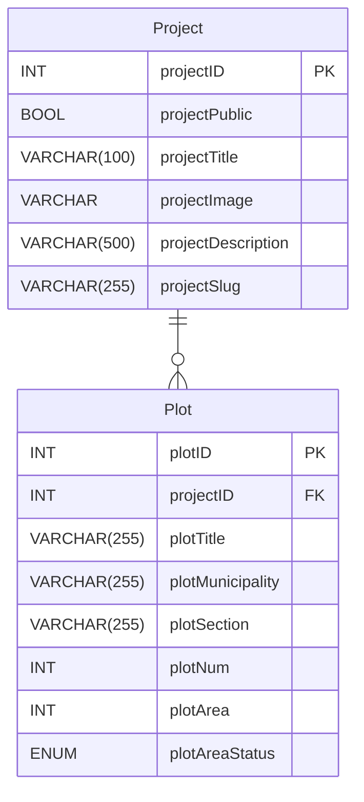

```mermaid
erDiagram

Project{
    INT projectID PK
    BOOL projectPublic
    VARCHAR(100) projectTitle
    VARCHAR projectImage
    VARCHAR(500) projectDescription
    VARCHAR(255) projectSlug 
}

Plot{
    INT plotID PK
    INT projectID FK
    VARCHAR(255) plotTitle
    VARCHAR(255) plotMunicipality
    VARCHAR(255) plotSection
    INT plotNum
    INT plotArea
    ENUM plotAreaStatus
}

Project || -- o{ Plot:""
```